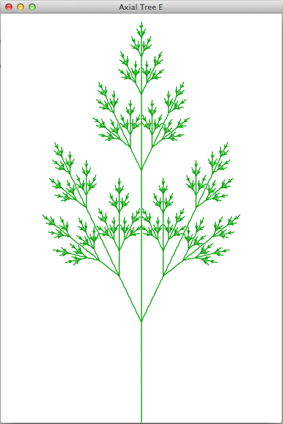
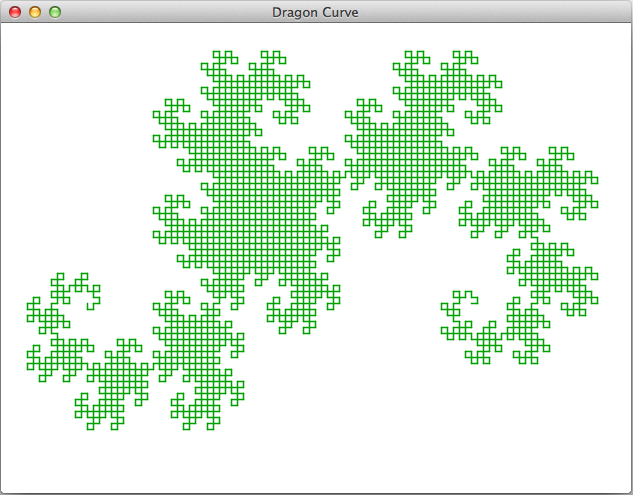
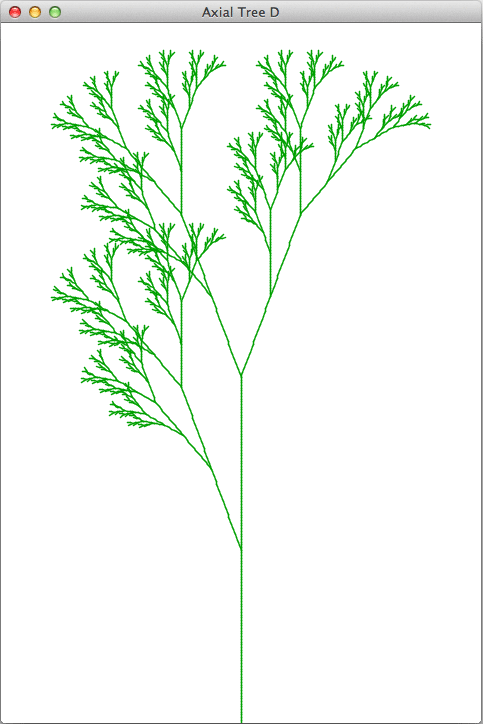
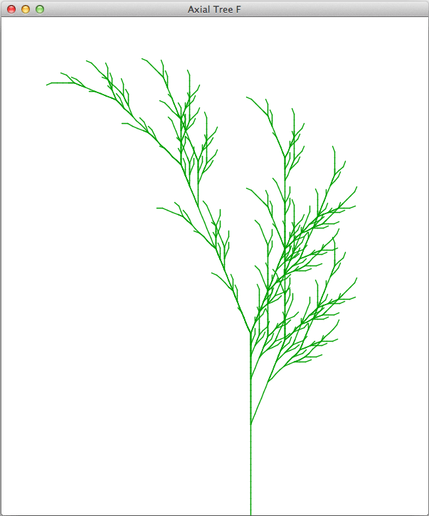
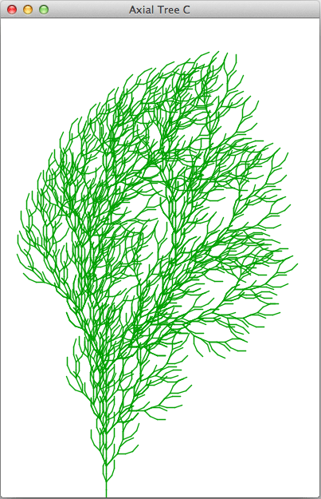

L-system fun
============

What is it?
----------
To improve my Clojure skills, I decided to tackle a small self-contained problem with results that are quick and fun.

More specifically, I wanted to generate axial trees, mostly because they are beautiful to look at, but also because it requires the additional step of implementing a Bracketed OL-system, since the definition of tree L-systems does not specify the data structure for representing axial trees.

I was surprised to discover how little code was required to satisfy my goal of generating and plotting [L-system] data.

The code is probably of little practical re-use value, but you are free to do what you like with it.

I found a Wikipedia article about **L-systems (Lindenmayer Systems)** and was immediately attracted to the images of patterns that mimicked the growth processes of plants. This inspired me to write some code to generate code to generate these systems and their branching structures.

Usage
-----

If you have Leiningen installed, you probably already know the drill:

    lein deps
    lein repl

Once in the REPL you can generate an L-system pattern by specfiying the
grammar name and the nth generation that you want:

    l-system.display=> (gen-commands dragon-curve 5)
    "FX+YF+FX-YF+FX+YF-FX-YF+FX+YF+FX-YF-FX+YF-FX-YF+FX+YF+FX-YF+FX+YF-FX-YF-FX+YF+FX-YF-FX+YF-FX-YF"
    
... or for an axial tree:

    l-system.display=> (gen-commands axial-tree-f 2)
    "FF-[[F-[[X]+X]+F[+FX]-X]+F-[[X]+X]+F[+FX]-X]+FF[+FFF-[[X]+X]+F[+FX]-X]-F-[[X]+X]+F[+FX]-X"

To view graphical output of applets that plot using the constants (commands) of these L-systems:

    l-system.display=> (display tree-f-applet)

Other applets include the dragon-curve (display dragon-applet). Check src/l_system/display.clj for more applet definitions.


Discussion
----------

###L-systems

L-systems were originally developed as a mathematical theory of plant development. They are based upon a disarmingly simple idea that can generate an incredibly diverse range of fascinating and extremely intricate patterns.



L-systems are [Rewriting Systems](http://en.wikipedia.org/wiki/Rewriting_system). In this case the rewriting takes the following form: characters in a sequence of characters are replaced
by other characters, according to a simple set of replacement rules. The resulting string of characters can be interpreted and used as drawing commands for a
[turtle graphics](http://en.wikipedia.org/wiki/Turtle_graphics) pen to
draw lines.

For example, the L-system 'grammar' that represents the Sierpinski Triangle looks like this:

    variables : A B
    constants : + −
    start     : A
    rules     : (A → B−A−B), (B → A+B+A)
    angle     : 60°

This looks a little cryptic, but really it's not; it means that for each iteration you do the following:

  - Start off with a single `A` _variable_.
  - If you see a _variable_ `A` replace it with `B-A-B` and if you see a `B`, then replace it with `A+B+A`.
  - If you see the _constants_ `+` or `-` then do nothing; you can simply ignore them and move on to the next
    character in the sequence.

Once we've got our generated sequence, the `-` and `+` characters are used to control the graphics _turtle_, which always has a position and orientation. These characters represent left and right turn instructions. The angle of turn in this example would be 60°.

Variables like `A` can be used to represent turtle command to 'go forward'.

I chose to represent the rules like this with a simple hash map:

```clojure
(def sierpinski-triangle {:constants #{\+ \-}
                          :start     [\A]
                          :rules     {\A "B-A-B"
                                      \B "A+B+A"}
                          :angle      60
                          :cmd-map   {\A :forward
                                      \B :forward
                                      \+ :left
                                      \- :right}})
```
Note that there is a second level map that translates characters to
commands. This extra level of indirection is necessary because some rule sets have multiple characters mapping to a single command.

I'd planned to use [keywords](http://clojure.org/data_structures#toc8) for all the map keys, however, it turns out that whilst the Clojure reader will allow `:A`, `:B` or `:+`, it does not presently allow `:[` or `:]`. Later, it transpired that it's better to use characters anyway, since they are each   returned when the pattern string
is seq'ed.

Clojure's keywords are similar to Ruby's symbols, and a single character is represented by a backslash preceding the character symbol, e.g. `\F` or `\A`.

The strings grow rapidly with each successive production (generation) 'n'. Output from my REPL:

    l-system.core=> (gen-commands sierpinski-triangle 1)
    "B-A-B"
    l-system.core=> (gen-commands sierpinski-triangle 2)
    "A+B+A-B-A-B-A+B+A"
    l-system.core=> (gen-commands sierpinski-triangle 3)
    "B-A-B+A+B+A+B-A-B-A+B+A-B-A-B-A+B+A-B-A-B+A+B+A+B-A-B"

Just 7 productions will yield a 4373 character string.

Here's some successive productions for the Dragon Curve:

    l-system.core=> (gen-commands dragon-curve 1)
    "FX+YF"
    l-system.core=> (gen-commands dragon-curve 2)
    "FX+YF+FX-YF"
    l-system.core=> (gen-commands dragon-curve 3)
    "FX+YF+FX-YF+FX+YF-FX-YF"
    l-system.core=> (gen-commands dragon-curve 4)
    "FX+YF+FX-YF+FX+YF-FX-YF+FX+YF+FX-YF-FX+YF-FX-YF"

7 productions of the Dragon curve grammar will produce instructions that can be translated to commands that draw this:



I've use the [Processing](http://processing.org/) library to render the drawing. That's one of the great value propositions of Clojure - Java interop and access to the entire world of Java libraries
without having to write Java. It's trivial to use the library directly, but there's also a nice Clojure wrapper around it called [Quil](https://github.com/quil/quil), which offers a sweeter, more idiomatically _Clojure_ API.

### Bracketed L-systems & Axial Trees
L-systems in their simplest form produce a character sequence that represent a series of line segments from the turtle graphics movements of left, right, forward. However, in order to create branching structures, some new commands are needed to represent saving (push) and restoring (pop) turtle locations (coordinates) to and from a [LIFO](http://en.wikipedia.org/wiki/LIFO_(computing\)) stack.

This is achieved by including bracket characters in the rules. `[` Means 'push the current state (position) of the turtle onto a push-down stack', and `]` means 'Pop a state from the stack and make it the current state of the turtle'.

Here's an axial tree described with bracketed rules:

```clojure A map of rules for an axial tree
(def axial-tree-a {:start     [\F]
                   :rules     {\F "F[+F]F[-F]F"}
                   :angle     25.7
                   :constants #{\F \+ \- \[ \]}
                   :cmd-map   {\F :forward
                               \+ :left
                               \- :right
                               \[ :push
                               \] :pop}})
```

It's easy to see how the sequence of characters in the grammar above e.g. `F[+F]F[-F]F` could be
sequentially applied (replaced), and it's pretty trivial:

```clojure Using pattern replacement to generate strings
(defn apply-rules [grammar pattern]
  (apply str
         (replace (:rules grammar) pattern)))

(defn gen-commands [grammar n]
  (nth
    (iterate
      (partial apply-rules grammar) (:start grammar))
    n))
```

Once we've got the sequence of commands, for example `"F[+F]F[-F]F[+F[+F]F[-F]F]F[+F]F[-F]F[-F[+F]F[-F]F]F[+F]F[-F]F"`,
we can iterate over them and dispatch each command until there are none left.

##Results!

The outputs were rather pleasing:





I'm not entirely convinced this one looks natural, but the windswept look is cool:




License
-------

Copyright (C) 2011 Scott Lowe

Licensed under the terms of the MIT License

[L-system]: http://en.wikipedia.org/wiki/L-system
